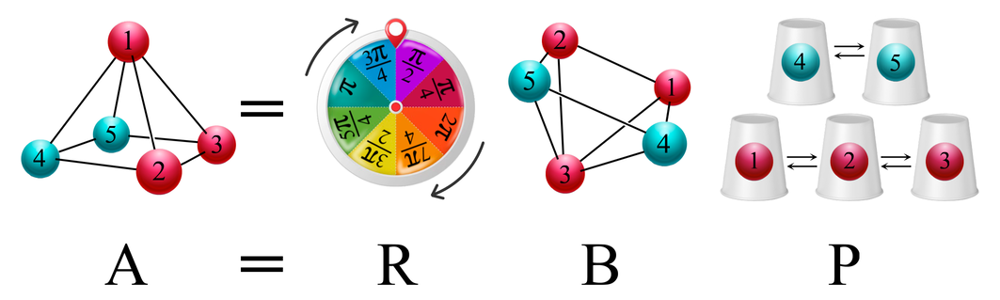

# PyMolAlign

This is a Python wrapper for [MolAlignLib](https://github.com/qcuaeh/molalignlib), [IRA](https://github.com/mammasmias/IterativeRotationsAssignments) & [ArbAlign](https://github.com/berhane/arbalign).

### Reference

1. J. M. Vasquez-Perez, L. A. Zarate-Hernandez, C. Z. Gomez-Castro, U. A. Nolasco-Hernandez. A Practical Algorithm to Solve the Near-Congruence Problem for Rigid Molecules and Clusters, Journal of Chemical Information and Modeling (2023), DOI: https://doi.org/10.1021/acs.jcim.2c01187
2. Miha Gunde, Nicolas Salles, Anne Hémeryck, and Layla Martin-Samos. IRA: A Shape Matching Approach for Recognition and Comparison of Generic Atomic Patterns , Journal of Chemical Information and Modeling (2021), DOI: https://doi.org/10.1021/acs.jcim.1c00567
3. Berhane Temelso, Joel M. Mabey, Toshiro Kubota, Nana Appiah-Padi, eorge C. Shields,. ArbAlign: A Tool for Optimal Alignment of Arbitrarily Ordered Isomers Using the Kuhn−Munkres Algorithm (2016), DOI: https://doi.org/ 10.1021/acs.jcim.6b00546
